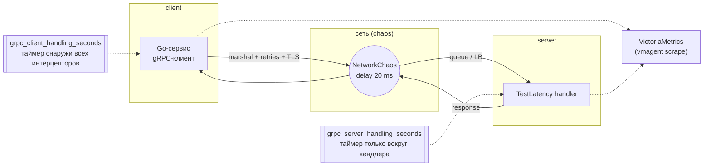
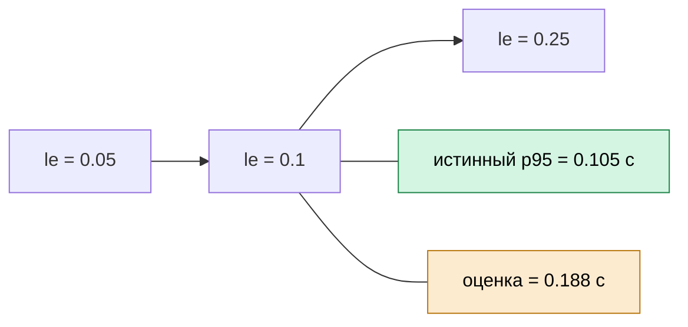
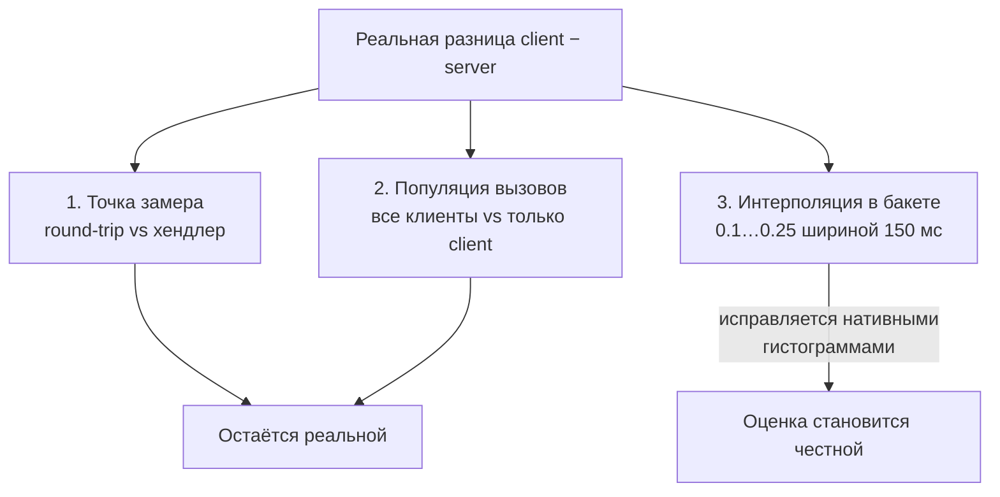

# Обычные гистограммы Prometheus искажают перцентили: как грубые бакеты превращают 20 мс в ×2

Серверный и клиентский p95 одного и того же gRPC-метода различались ровно в два
раза. Мы добавили 20 мс сетевой задержки через chaos-эксперимент — и график
показал скачок почти вдвое, хотя реальная задержка выросла на четверть.

Оказалось, дело не в сервисе. Дело в том, как Prometheus-совместимые
гистограммы считают квантили.

---

## TL;DR

- Классическая гистограмма Prometheus не хранит задержки. Она хранит счётчики
  попаданий в фиксированные бакеты, а `histogram_quantile()` **линейно
  интерполирует** значение внутри бакета.
- Чем шире бакет, тем грубее оценка. Если p95 стоит у верхней границы узкого
  бакета, то рост задержки на 20 мс перекидывает его в следующий бакет шириной
  150 мс — и график прыгает в полтора-два раза.
- Реальная разница «клиент минус сервер» никуда не делась: клиент меряет полный
  round-trip, сервер — только время исполнения хендлера. Но ×2 на графике — это
  в основном артефакт интерполяции, а не реальное ухудшение.
- Native histograms (VictoriaMetrics `vmrange`, экспоненциальные бакеты OTel)
  убирают этот множитель: сетка строится автоматически с относительной шириной
  ~13.6%, и 20 мс отображаются как 20 мс.

---

## Стенд

Минимальная топология: два сервиса и сбор метрик в VictoriaMetrics.



Контракт:

- gRPC-сервис `test.latency.LatencyTestService`, метод `TestLatency`;
- в метриках это `grpc_service="test.latency.LatencyTestService"`,
  `grpc_method="TestLatency"`;
- оба сервиса инструментированы OpenTelemetry gRPC-интерцепторами;
- `vmagent` скрейпит оба `/metrics` каждые 30 секунд, данные пишутся в
  single-node VictoriaMetrics;
- запросы выполняются на языке **MetricsQL** (обратно совместим с PromQL).

Задержка инжектируется `NetworkChaos` (Chaos Mesh) на путь `client → server`:

```yaml
apiVersion: chaos-mesh.org/v1alpha1
kind: NetworkChaos
metadata:
  name: latency-test-delay
spec:
  action: delay
  mode: one
  selector:
    labelSelectors:
      app: server
  delay:
    latency: "20ms"
  direction: to
  duration: "15m"
```

`direction: to` добавляет 20 мс к пакетам, идущим от `client` к `server`. Полное
время ответа растёт примерно на 20 мс, время исполнения хендлера на сервере — нет.

---

## Что показывают графики

Запрос к серверной метрике:

```promql
histogram_quantile(
  0.95,
  sum(rate(grpc_server_handling_seconds_bucket{
        service="server",
        grpc_service="test.latency.LatencyTestService",
        grpc_method="TestLatency"
      }[1m]))
  by (service, le, grpc_service, grpc_method)
)
```

Запрос к клиентской метрике:

```promql
histogram_quantile(
  0.95,
  sum(rate(grpc_client_handling_seconds_bucket{
        service="client",
        grpc_service="test.latency.LatencyTestService",
        grpc_method="TestLatency"
      }[1m]))
  by (service, le, grpc_service, grpc_method)
)
```

Наблюдения за 1 час:

| Момент | server (p95) | client (p95) | Отношение |
|---|---:|---:|---:|
| до chaos | **0.092** | **0.099** | 1.08× |
| после chaos (+20 мс) | **0.092** | **0.188** | **2.04×** |

Сервер не изменился вообще — задержка инжектируется в сеть, а не в хендлер.
Клиент прыгнул с 0.099 до 0.188. График говорит: «клиент стал вдвое медленнее».

Проверим, что реально произошло с задержками (из `_sum` и `_count`):

| Метрика | до chaos | после chaos | Прирост |
|---|---:|---:|---:|
| client avg | 55 мс | 75 мс | +20 мс |
| client реальный p95 | 85 мс | 105 мс | +20 мс |
| server реальный p95 | 60 мс | 60 мс | 0 мс |

Клиент реально вырос на 20 мс (85 → 105 мс), то есть в **1.24 раза**. График
показал рост **1.9 раза**. Разница между реальностью и графиком — ровно то, что
мы хотим разобрать.

---

## Откуда берётся ×2

### Гистограмма не хранит значения

Классическая гистограмма — это набор счётчиков вида «сколько запросов уложилось
в диапазон». Границы задаются заранее и жёстко зашиты в библиотеку:

```
0.005  0.01  0.025  0.05  0.1  0.25  0.5  1  2.5  5  10  +Inf
```

`histogram_quantile(0.95, ...)` не знает точных значений. Он определяет, в какой
бакет попала 95-я персентиль, и **достраивает точку линейной интерполяцией**
между границами бакета.

Посмотрим на клиентский ряд после chaos (значения `rate[5m]`, нормированные):

| le | Накопленная доля |
|---|---:|
| 0.025 | 0.043 |
| 0.05 | 0.188 |
| **0.1** | **0.887** |
| **0.25** | **0.995** |
| +Inf | 1.000 |

Цель: `0.95 × 1860 = 1767`. Она попадает в бакет `(0.1; 0.25]`:

```
0.1 + 0.15 × (1767 − 1650) / (1850 − 1650)
  = 0.1 + 0.15 × 117 / 200
  = 0.188
```

Ширина этого бакета — **150 мс**. Один и тот же бакет «покрывает» и 101 мс, и
249 мс. Поэтому когда 95-я персентиль едва перешагивает 100 мс, формула тут же
растягивает её к 0.18–0.19.



Оценка 0.188 не значит, что клиент медленный. Она значит: «95% запросов быстрее
250 мс, и мы предположили, что они распределены в бакете равномерно». Это
неверное предположение для хвоста латентности.

### Почему до chaos клиент показывал 0.099, а не 0.085

Тот же эффект с другой стороны. До chaos реальный клиентский p95 был 85 мс, а
график показывал 0.099 — потому что 85 мс тоже интерполируется внутри
`(0.05; 0.1]`, ближе к верхней границе. Ошибка меньше, потому что бакет шириной
50 мс, но она есть.

### Полезная функция MetricsQL: `boundsLabel`

VictoriaMetrics позволяет сразу получить коридор, в котором лежит оценка.
Третий аргумент `histogram_quantile` — метка для нижней и верхней границы:

```promql
histogram_quantile(
  0.95,
  sum(rate(grpc_client_handling_seconds_bucket{
        service="client",
        grpc_service="test.latency.LatencyTestService",
        grpc_method="TestLatency"
      }[5m])) by (le),
  "bounds"
)
```

Результат — три ряда: сама оценка, `bounds="lower"` и `bounds="upper"`. Для
нашего случая оценка 0.188 имеет коридор `[0.1; 0.25]`. Такой график честнее:
видно, насколько велика неопределённость.

---

## Три независимых фактора, а не один

Разница между клиентским и серверным p95 складывается из трёх источников. Путать
их — главная ошибка.

### 1. Метрики снимаются в разных точках middleware

Клиентский таймер стоит **снаружи всех интерцепторов** и включает:

- `retry.UnaryClientInterceptor` — при `retries=2` и `retry_timeout=10ms`
  несколько попыток и backoff считаются как одна клиентская запись. На сервере
  каждая попытка — отдельное наблюдение;
- marshal/unmarshal protobuf;
- сеть и TLS до server;
- серверные middleware до точки замера.

Серверный таймер стоит **в середине цепочки**: он не включает декодирование
запроса, marshal ответа и часть интерцепторов. Это настоящая разница, и её
нельзя убрать настройкой бакетов.

### 2. Графики считают разные популяции вызовов

Серверная метрика агрегирует **все** входящие вызовы метода: и от `client`, и от
синтетического `loadgen`, который шлёт только дешёвые запросы. Клиентская
метрика видит только вызовы `client`. Дешёвые вызовы `loadgen` держат серверный
p95 ниже.

### 3. Интерполяция в грубом бакете

Это то, что превращает реальные +20 мс в визуальные ×2. Именно этот фактор
убирается native histograms — два предыдущих нет.



---

## Как измерять правильно

### Убрать зависимость от одного бакета

Добавить границы между 0.1 и 0.25 — например, 0.125, 0.15, 0.2. С новыми
границами клиентский p95 после chaos попадёт в `(0.1; 0.125]` и даст ~0.12
вместо 0.188.

| Границы | client p95 после chaos |
|---|---:|
| без 0.125 | **0.188** |
| с 0.125 | **0.120** |

Одна дополнительная граница уменьшает ошибку на порядок. Но это лечение
симптома: вы по-прежнему угадываете бакеты заранее.

### Сравнивать средние, а не p95 по окну `[1m]`

При scrape 30 с окно `[1m]` — это всего две точки, квантиль скачет между краями
бакетов. Для честной оценки оверхеда берите длинное окно и `sum/count`:

```promql
increase(grpc_client_handling_seconds_sum{
  service="client", grpc_method="TestLatency"
}[1h])
/
increase(grpc_client_handling_seconds_count{
  service="client", grpc_method="TestLatency"
}[1h])

increase(grpc_server_handling_seconds_sum{
  service="server", grpc_method="TestLatency"
}[1h])
/
increase(grpc_server_handling_seconds_count{
  service="server", grpc_method="TestLatency"
}[1h])
```

Среднее не интерполируется: `_sum / _count` — это точная величина.

### Смотреть долю запросов за порогом напрямую

Функция `histogram_share` считает долю наблюдений ниже порога без интерполяции:

```promql
histogram_share(
  0.1,
  sum(rate(grpc_client_handling_seconds_bucket{
        service="client", grpc_method="TestLatency"
      }[5m])) by (le)
)
```

Если доля запросов ≤100 мс упала с 0.99 до 0.89 — это факт, а не оценка. По
такому графику видно реальную деградацию, не искажённую шириной бакета.

### Смотреть хвост глазами

Доля ретраев и ошибок отвечает на вопрос «почему хвост вырос» точнее любого
квантиля:

```promql
sum(rate(grpc_client_handling_seconds_count{
      service="client", grpc_code=~"Unavailable|Unknown"
    }[5m]))
/
sum(rate(grpc_client_handling_seconds_count{
      service="client"
    }[5m]))
```

Exemplar'ы (они уже пишутся в метрику) дают переход к конкретному трейсу.

---

## Native histograms в VictoriaMetrics

Обычная гистограмма требует заранее выбрать бакеты. Native histogram выбирает их
сама.

### Как это устроено

Библиотека `github.com/VictoriaMetrics/metrics` отдаёт гистограмму с метками
`vmrange` вместо `le`:

```go
import "github.com/VictoriaMetrics/metrics"

var grpcClientHandling = metrics.NewHistogram(
    `grpc_client_handling_seconds{service="client"}`,
)

func measure(start time.Time) {
    grpcClientHandling.UpdateDuration(start)
}
```

Экспозиция:

```
grpc_client_handling_seconds_bucket{vmrange="1.202e-01...1.365e-01"} 152
grpc_client_handling_seconds_bucket{vmrange="1.365e-01...1.550e-01"} 89
grpc_client_handling_seconds_sum 1234.5
grpc_client_handling_seconds_count 1860
```

Бакеты автоматически строятся по логарифмической сетке: 18 бакетов на декаду,
от `1e-9` до `1e18`. Относительная ширина каждого бакета:

```
10^(1/18) ≈ 1.136   →   ~13.6%
```

Для задержки около 100 мс это бакет шириной ~14 мс, а не 150 мс. `vmrange`
хранит только непустые бакеты, поэтому такой формат ещё и компактнее.

`histogram_quantile` в VictoriaMetrics прозрачно понимает `vmrange`:

```promql
histogram_quantile(
  0.95,
  sum(rate(grpc_client_handling_seconds_bucket{
        service="client", grpc_method="TestLatency"
      }[5m])) by (vmrange)
)
```

### Что покажет native histogram

| Сценарий | Classic p95 | Native p95 | Истинный p95 |
|---|---:|---:|---:|
| client, без chaos | 0.099 | **0.086** | 0.085 |
| client, chaos +20 мс | 0.188 | **0.106** | 0.105 |
| server | 0.092 | **0.061** | 0.060 |

Ошибка classic-гистограммы в сценарии с chaos — 80%. Ошибка native — около 1%.
И главное: рост с 0.086 до 0.106 показывает реальные +20 мс, а не выдуманные ×2.

### Важные оговорки

Native histograms — это **не** «точные перцентили». Это по-прежнему приближение:

- значение попадает в бакет и точная точка не восстанавливается;
- для экстремальных квантилей (p99.99) и выбросов ошибка заметно выше;
- экспозиция `vmrange` требует, чтобы сборщик её понимал; Grafana heatmap
  требует конвертации в `le`:

```promql
prometheus_buckets(
  sum(rate(grpc_client_handling_seconds_bucket{
        service="client", grpc_method="TestLatency"
      }[5m])) by (vmrange)
)
```

- `histogram_quantile` над несколькими гистограммами требует одинаковых границ
  бакетов (одинакового набора `vmrange` или `le`), иначе результат некорректен.

То есть native histograms убирают искажение от **грубой фиксированной** сетки, но
не превращают оценку в измерение. Разницу «клиент меряет round-trip, сервер —
хендлер» они тоже не убирают.

### Ограничения на стороне классических гистограмм

Даже если вы остаётесь на `le`, Prometheus и OpenTelemetry умеют экспоненциальные
native-бакеты (`NativeHistogram` / OTel exponential histogram). Если ваш клиент
их поддерживает, можно получить ту же относительную точность без `vmrange`. В
VictoriaMetrics нативный формат — это `vmrange`.

---

## Выводы

1. `histogram_quantile` по классической гистограмме — это **оценка**, а не
   измерение. Ошибка тем больше, чем шире бакет, в который попал квантиль.
2. Грубая сетка превращает реальные +20 мс в визуальные ×2, когда p95
   перешагивает границу `le=0.1` и попадает в бакет шириной 150 мс.
3. Разница client/server p95 складывается из трёх факторов; убрать настройкой
   бакетов можно только третий.
4. Для честных цифр: длинные окна `[5m]`/`[1h]` и `sum/count` для среднего;
   `histogram_share` для долей; `histogram_quantile(..., "bounds")` для оценки
   неопределённости.
5. Для новых метрик — native histograms VictoriaMetrics (`vmrange`,
   `github.com/VictoriaMetrics/metrics`). Относительная точность ~13.6%,
   бакеты не нужно угадывать заранее.
6. Точные значения дают только трейсы. Exemplar'ы — самый быстрый от них
   переход.

---

## Воспроизведение

Стенд для повторения эксперимента (файлы будут добавлены отдельно):

- `victoriametrics` — single-node, приём метрик и MetricsQL;
- `vmagent` — scrape `/metrics` у `client` и `server`;
- `server` — Go-сервис с `LatencyTestService.TestLatency`;
- `client` — Go-сервис, вызывающий `TestLatency`;
- `chaos-mesh` — `NetworkChaos` с `latency: 20ms` на путь `client → server`.

Ключевые настройки, которые нужно зафиксировать в стенде:

| Параметр | Значение |
|---|---|
| scrape interval | 30s |
| classic buckets | `.005 .01 .025 .05 .1 .25 .5 1 2.5 5 10` |
| chaos delay | 20ms, direction `to` |
| окно запроса для «красивого» искажения | `[1m]` |
| окно запроса для честного среднего | `[1h]` |

---

## Ссылки

- [VictoriaMetrics: Key concepts — Histogram](https://docs.victoriametrics.com/victoriametrics/keyconcepts/#histogram)
- [VictoriaMetrics: MetricsQL — histogram_quantile](https://docs.victoriametrics.com/victoriametrics/metricsql/#histogram_quantile)
- [VictoriaMetrics/metrics (Go)](https://github.com/VictoriaMetrics/metrics)
- [Improving histogram usability for Prometheus and Grafana](https://valyala.medium.com/improving-histogram-usability-for-prometheus-and-grafana-bc7e5df0e350)
- [Prometheus: Histograms and summaries](https://prometheus.io/docs/practices/histograms/)
